 

  

  <h3 align="center">Smart Wallet: Track Your Everyday Expenses Smartly</h3>

A modern expense tracking application that helps you manage your finances efficiently with secure authentication and comprehensive expense management features.

## Features

- **User Authentication**: Secure login and registration system
- **Expense Management**:
  - Add new expenses with categories
  - Edit existing expenses
  - Delete expenses
- **Financial Accounts**:
  - Add bank accounts and cards
  - Manage and delete financial accounts
- **Comprehensive Dashboard**: Visual overview of your spending patterns
- **Secure Storage**: All sensitive data encrypted and stored safely

## Technology Stack

- **Framework**: Flutter
- **State Management**: BLoC
- **Dependency Injection**: GetIt
- **Navigation**: GoRouter
- **API Client**: Dio
- **Local Storage**: Flutter Secure Storage (to store credentials) & Shared Preference

## Architecture & Principles

- **Clean Architecture**: Separation of concerns with clear layers (Presentation, Domain, Data)
- **Domain-Driven Design**: Focused on core business logic
- **SOLID Principles**: Maintainable, scalable and testable codebase
- **Functional Programming**: To avoid any kind of error

    <h3 align="center">App Screen Shot</h3>

    

      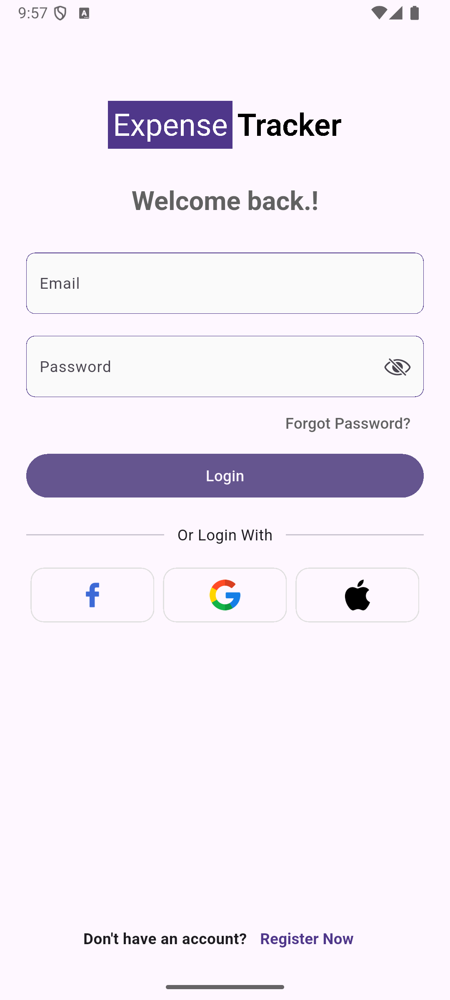 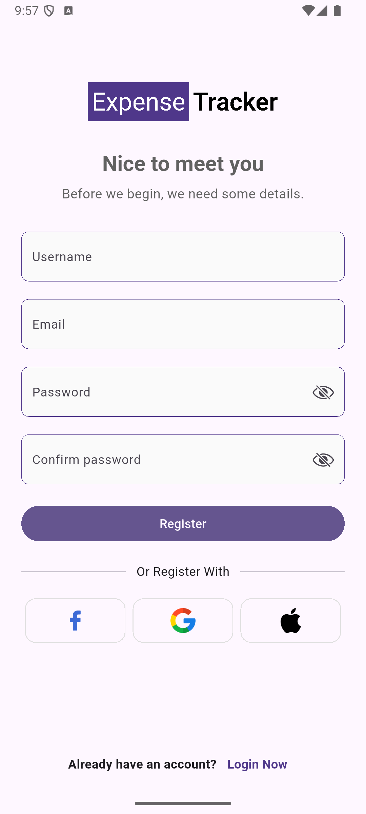 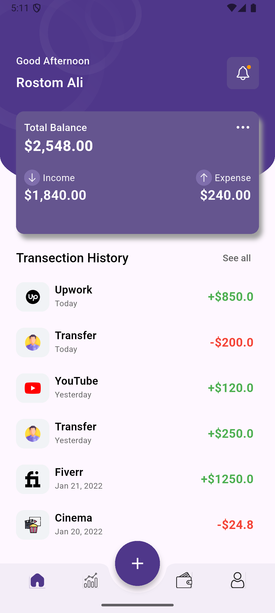 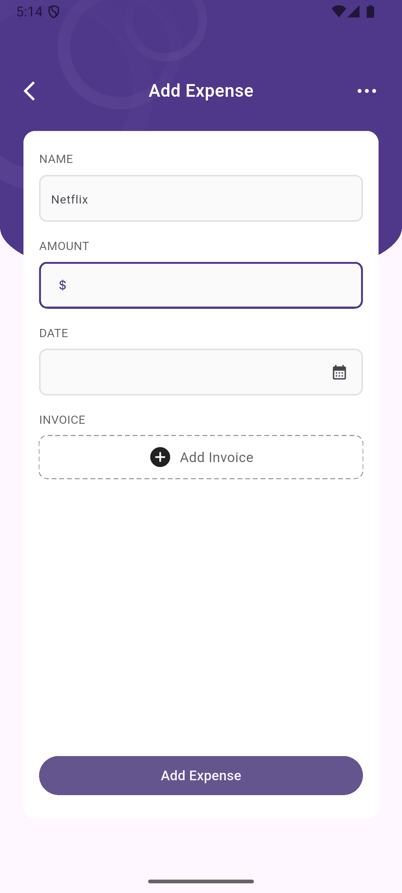
    

    

      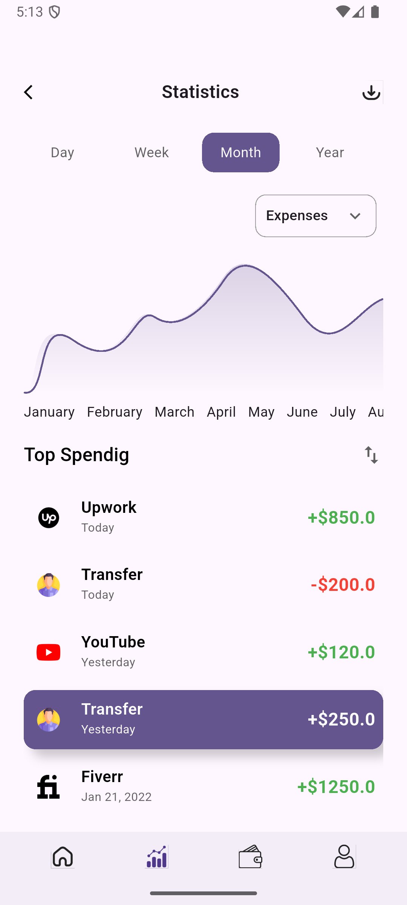 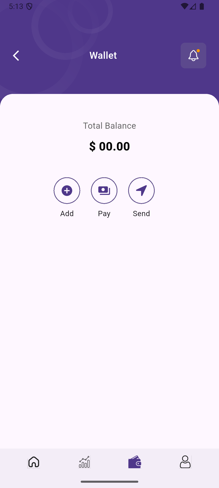 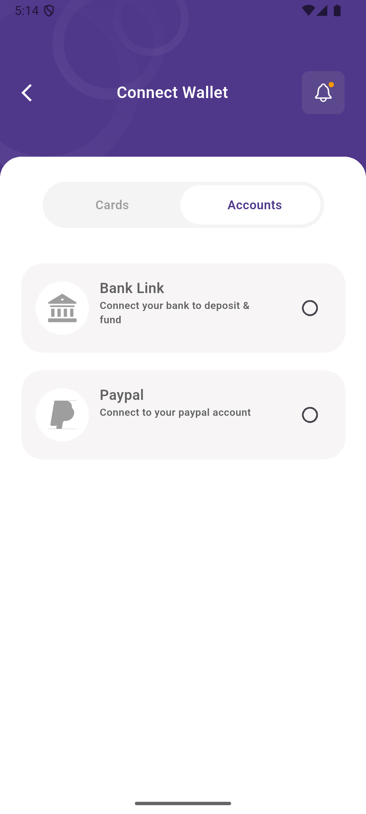 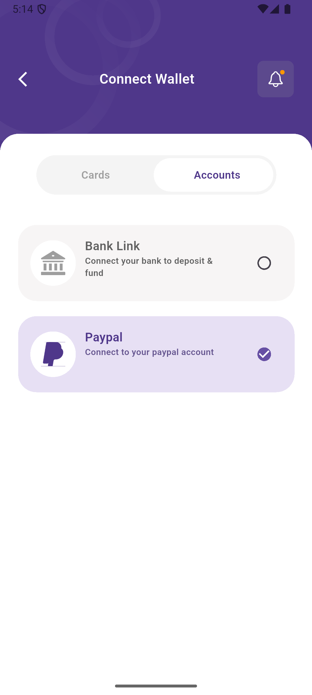
    

    

      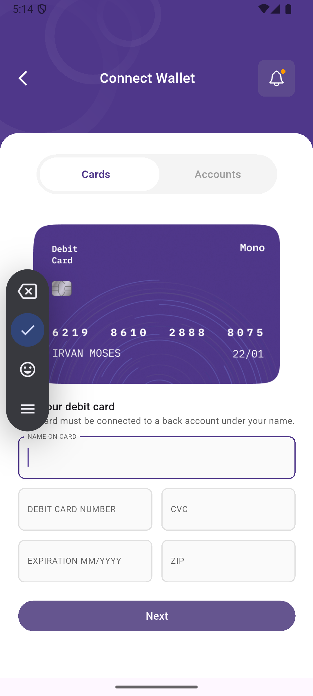 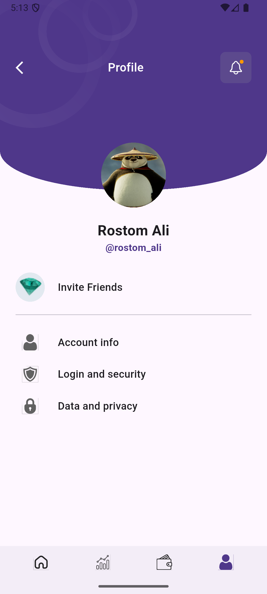 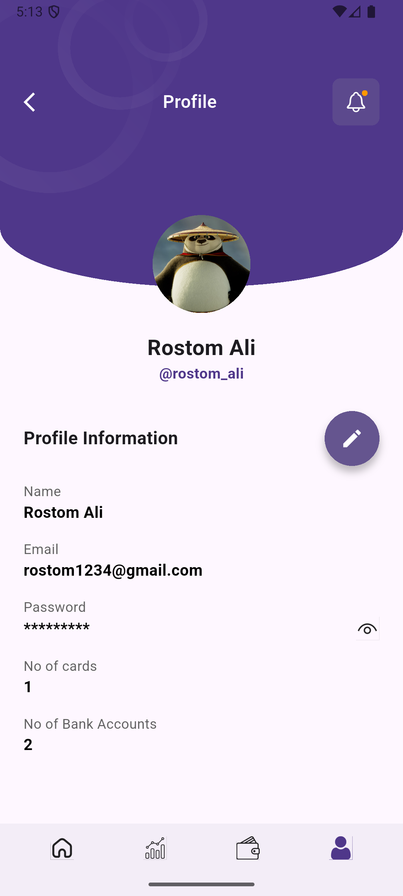 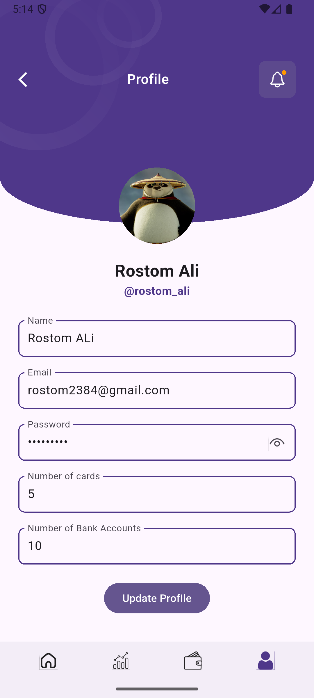
    

  

   

## Getting Started

To run this project locally:

# You need flutter version: 3.32.5

1. Clone the repository
2. Run `fvm flutter pub get`
3. Configure your environment variables
4. Run `fvm flutter run`
